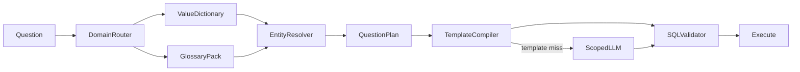

# NQL Insight Architecture Blueprint

## Executive finding

The legacy Streamlit NLQ path was more accurate because `core/schema_builder.py`
placed real dataset literals (`top_values`) beside each text column in the LLM
schema. `semantic/semantic_context_builder.py` then added question-matched
glossary hints, physical columns, relationships, and domain rules. The live path
was semantic-enriched LLM SQL; the older deterministic compiler was not wired.

Before remediation, askdb used a small template set and a static schema hint that
did not contain business values. The current plan/template path fixes salesperson
and body-style routing, but a live value dictionary is required for cities,
makes, colours, insurance products, statuses, and channels.

## Data intelligence

The Streamlit CSVs and askdb PostgreSQL seeds are separate corpora and must not
share hard-coded value lists.

### Automotive

- CSV fact grain: one sales order; 65,000 rows; no `dealer_id`.
- PostgreSQL fact grain: one sales order; includes `dealer_id`.
- CSV body styles: Hatchback, Compact SUV, SUV, Sedan, MPV.
- PostgreSQL body styles: Hatchback, Sedan, SUV, MUV, Coupe.
- Core entities: Vehicle, Salesperson, Dealer, Region, Colour, Target.
- Core measures: Units Sold, Revenue, Orders, Average Selling Price.
- Salesperson is a person in `dim_salesman`; dealer is an outlet in
  `dim_dealer`.
- Geography contains city, region, state, and country. Values include Mumbai,
  Pune, New Delhi, Bengaluru, Hyderabad, Chennai, and Kolkata.

### Insurance

- Separate claim, policy-month, policy, product, agent, and region grains.
- Business entities: Claim, Policy, Customer, Product/LOB, Agent, Region.
- Measures: GWP, earned premium, incurred/paid claims, claim count, severity,
  frequency, approval rate, renewal rate, and loss ratio.
- Filter domains include claim status/type, policy status, coverage tier,
  product, LOB, product family, channel, branch, region, and state.
- PostgreSQL seed taxonomies differ from CSV taxonomies; runtime database values
  are authoritative.

## Target flow

## Architecture rules

1. Resolve the industry before loading metadata or values.
2. Build the value dictionary from the selected live analytics database.
3. Match longest business literals first and retain canonical database spelling.
4. Preserve all explicit filters in `QuestionPlan`.
5. Prefer governed templates for frequent intents; use the LLM for the long tail.
6. Send only matched values, relevant glossary terms, and active-domain schema.
7. Reject SQL that drops filters, uses the wrong ranking direction, or references
   tables/columns outside the active semantic pack.
8. Cache dictionaries by industry with TTL to avoid query-time metadata scans.

## Failure-to-control mapping

| Failure | Root cause | Control |
|---|---|---|
| Salesperson returned dealer | Missing entity separation/template | Entity priority + required `dim_salesman` |
| Sedan/SUV filter lost | Values absent from plan | Canonical value match + mandatory SQL filter |
| Mumbai ignored | No place-name dictionary | Live city/region dictionary |
| Lowest returned highest | One ranking direction | Explicit ASC/DESC in plan |
| Insurance product/status ignored | Thin insurance plan | Insurance entity and value extraction |
| Hallucinated columns | String-only validation | Semantic-pack table/column whitelist |

## Performance envelope

- Dictionary load: one bounded metadata query per industry per TTL.
- Question matching: in-memory longest-first scan over bounded categorical values.
- Prompt addition: only matched values and relevant join recipes, normally a few
  hundred characters.
- Full YAML and both industries are never included in one prompt.
- Template hits remain zero-LLM.

## Verification contract

Benchmarks must assert intent, entity, metric, filter column/value, ranking
direction, generated SQL, domain isolation, and rejection of invalid SQL. Live
integration tests additionally execute representative automotive and insurance
questions against seeded PostgreSQL.
