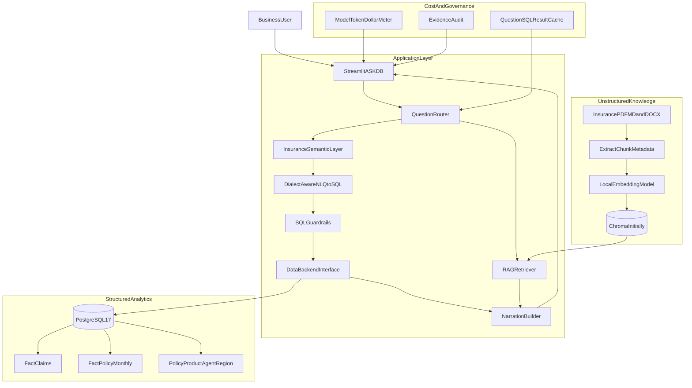
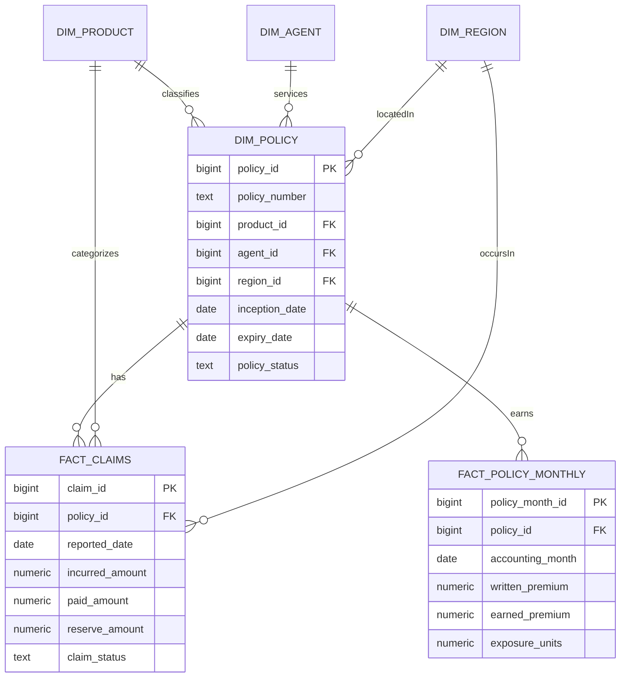

# ASK-DB Insurance Modernization Blueprint

## PostgreSQL, 1M-Row Analytics, RAG Narration, Cost Control, and Leadership Demo

**Status:** Implementation-ready design  
**Target:** Local PostgreSQL 17 first; same connection model supports Neon, Supabase, Azure PostgreSQL, or AWS RDS later  
**Data domain:** General insurance / P&C pilot  
**Application:** Existing Streamlit ASK-DB application  
**Primary constraint:** Preserve the current CSV + DuckDB demo path while adding PostgreSQL as the scalable path

---

## 1. Executive decision

ASK-DB should become a **dual-backend product**:

- **CSV + DuckDB:** sandbox, workshops, small demos.
- **PostgreSQL:** insurance pilot, persistent data, 1M+ rows, exact KPI computation, multi-user-ready path.
- **Chroma initially:** document embeddings for insurance RAG, because it already exists in the codebase.
- **pgvector later:** once PostgreSQL is stable, move document embeddings behind a vector backend abstraction.

The upgrade must not simply replace `duckdb.connect()` with PostgreSQL. The current application assumes:

- the complete dataset is a Pandas DataFrame;
- the main SQL table is named `"df"`;
- SQL uses DuckDB syntax such as `strftime`;
- joins happen before query time;
- caches are fingerprinted from DataFrame shape and columns;
- KPI and DQ engines scan an in-memory working DataFrame.

Those assumptions need a deliberate backend abstraction and SQL dialect layer.

---

## 2. Leadership “wow” outcome

The target demonstration should tell one coherent story:

1. Sidebar shows **Connected: PostgreSQL · Insurance · 1,000,000 claims**.
2. KPI Summary shows ten governed insurance KPIs computed in PostgreSQL.
3. User asks:  
   **“Why did the motor loss ratio deteriorate in Q2, and what action does the claims SOP recommend?”**
4. ASK-DB:
   - resolves insurance metrics from the semantic model;
   - generates PostgreSQL SQL;
   - scans 1M records server-side;
   - returns a small aggregate result;
   - retrieves the relevant claims SOP passage from RAG;
   - narrates the numerical finding plus operating guidance;
   - shows document/page citations, SQL, execution time, source, trust, and estimated LLM cost.
5. Follow-up:  
   **“Drill down by product and region.”**
6. The SQL anchor modifies the prior PostgreSQL query without re-explaining context.

This demonstrates scale, insurance knowledge, governance, cost visibility, and conversational continuity—not just a chatbot.

---

## 3. Target architecture



### Grounding rule

- **SQL owns numbers.**
- **RAG owns policy, definitions, procedures, and operating guidance.**
- **Narration combines both but may not invent or recompute KPIs from documents.**

---

## 4. Delivery scope

### In scope

- Local PostgreSQL 17 setup.
- Read-only application connection.
- Dual backend: `csv_duckdb` and `postgres`.
- PostgreSQL SQL generation and execution.
- Insurance schema for 1M claim records.
- Pack-aware insurance semantic model and top ten KPIs.
- PDF, Markdown, and DOCX knowledge ingestion.
- Chroma RAG feeding narration with citations.
- Cost-aware LLM routing and sidebar dollar estimate.
- Performance, security, regression, and leadership demo tests.

### Not in the first implementation

- Replacing Streamlit with React.
- Removing CSV mode.
- MongoDB as the core analytics store.
- Databricks.
- Full production SSO/RBAC.
- OCR for scanned PDFs.
- pgvector as the first vector backend.
- Loading 1M rows into Streamlit/Pandas.

---

# Part A — PostgreSQL setup

## 5. Local PostgreSQL 17 setup checklist

You have already installed PostgreSQL. Confirm:

- PostgreSQL service is running.
- pgAdmin 4 opens.
- You know the `postgres` administrator password.
- Port is `5432`.
- You can connect to the default `postgres` database.

### Recommended local names

| Purpose | Value |
|---|---|
| Database | `askdb_dev` |
| Schema | `insurance` |
| Read-only app user | `askdb_app` |
| Host | `localhost` |
| Port | `5432` |

---

## 6. Create database and read-only application user

Open **pgAdmin → Query Tool** while connected to the default `postgres` database.

Replace the password placeholder before running:

```sql
CREATE ROLE askdb_app
  LOGIN
  PASSWORD 'REPLACE_WITH_A_STRONG_LOCAL_PASSWORD'
  NOSUPERUSER
  NOCREATEDB
  NOCREATEROLE
  NOINHERIT;

CREATE DATABASE askdb_dev
  WITH ENCODING = 'UTF8'
       TEMPLATE = template0;
```

Then connect pgAdmin’s Query Tool to `askdb_dev` and run:

```sql
CREATE SCHEMA IF NOT EXISTS insurance;

REVOKE CREATE ON SCHEMA public FROM PUBLIC;

GRANT CONNECT ON DATABASE askdb_dev TO askdb_app;
GRANT USAGE ON SCHEMA insurance TO askdb_app;

ALTER DEFAULT PRIVILEGES IN SCHEMA insurance
  GRANT SELECT ON TABLES TO askdb_app;

ALTER DEFAULT PRIVILEGES IN SCHEMA insurance
  GRANT USAGE, SELECT ON SEQUENCES TO askdb_app;
```

### Security model

The Streamlit app connects as `askdb_app`, which receives:

- `CONNECT`
- schema `USAGE`
- table/view `SELECT`

It does **not** receive:

- INSERT
- UPDATE
- DELETE
- CREATE
- DROP
- ALTER

Application guardrails remain required, but database permissions provide a second enforcement layer.

---

## 7. Insurance database model

### Important correction to the current demo model

The current insurance pack stores `premium_amount` on every claim row. Summing premium from claim rows can duplicate premium when a policy has multiple claims.

The production pilot should use separate grains:

- `fact_claims`: one row per claim.
- `fact_policy_monthly`: one row per policy per accounting month.

That enables correct:

- written premium;
- earned premium;
- claim frequency;
- loss ratio;
- renewal/persistency;
- exposure-normalized metrics.

### Logical model



---

## 8. Create insurance tables

Run in `askdb_dev`:

```sql
CREATE TABLE insurance.dim_product (
    product_id          BIGINT GENERATED BY DEFAULT AS IDENTITY PRIMARY KEY,
    product_code        TEXT NOT NULL UNIQUE,
    product_name        TEXT NOT NULL,
    line_of_business    TEXT NOT NULL,
    product_family      TEXT,
    coverage_type       TEXT,
    active_flag         BOOLEAN NOT NULL DEFAULT TRUE
);

CREATE TABLE insurance.dim_agent (
    agent_id            BIGINT GENERATED BY DEFAULT AS IDENTITY PRIMARY KEY,
    agent_code          TEXT NOT NULL UNIQUE,
    agent_name          TEXT NOT NULL,
    channel_name        TEXT,
    branch_name         TEXT,
    active_flag         BOOLEAN NOT NULL DEFAULT TRUE
);

CREATE TABLE insurance.dim_region (
    region_id           BIGINT GENERATED BY DEFAULT AS IDENTITY PRIMARY KEY,
    region_code         TEXT NOT NULL UNIQUE,
    region_name         TEXT NOT NULL,
    state_name          TEXT,
    country_name        TEXT NOT NULL DEFAULT 'India'
);

CREATE TABLE insurance.dim_policy (
    policy_id           BIGINT GENERATED BY DEFAULT AS IDENTITY PRIMARY KEY,
    policy_number       TEXT NOT NULL UNIQUE,
    product_id          BIGINT NOT NULL REFERENCES insurance.dim_product(product_id),
    agent_id            BIGINT REFERENCES insurance.dim_agent(agent_id),
    region_id           BIGINT REFERENCES insurance.dim_region(region_id),
    customer_key        TEXT,
    inception_date      DATE NOT NULL,
    expiry_date         DATE NOT NULL,
    policy_status       TEXT NOT NULL,
    coverage_tier       TEXT,
    sum_insured         NUMERIC(18,2),
    cancelled_flag      BOOLEAN NOT NULL DEFAULT FALSE,
    CHECK (expiry_date >= inception_date)
);

CREATE TABLE insurance.fact_claims (
    claim_id                BIGINT PRIMARY KEY,
    claim_number            TEXT NOT NULL UNIQUE,
    policy_id               BIGINT NOT NULL REFERENCES insurance.dim_policy(policy_id),
    product_id              BIGINT NOT NULL REFERENCES insurance.dim_product(product_id),
    region_id               BIGINT REFERENCES insurance.dim_region(region_id),
    loss_date               DATE,
    reported_date           DATE NOT NULL,
    approved_date           DATE,
    settlement_date         DATE,
    claim_status            TEXT NOT NULL,
    claim_type              TEXT,
    reported_amount         NUMERIC(18,2) NOT NULL DEFAULT 0,
    approved_amount         NUMERIC(18,2) NOT NULL DEFAULT 0,
    paid_amount             NUMERIC(18,2) NOT NULL DEFAULT 0,
    reserve_amount          NUMERIC(18,2) NOT NULL DEFAULT 0,
    incurred_amount         NUMERIC(18,2)
        GENERATED ALWAYS AS (paid_amount + reserve_amount) STORED,
    approved_flag           BOOLEAN NOT NULL DEFAULT FALSE,
    repudiated_flag         BOOLEAN NOT NULL DEFAULT FALSE,
    fraud_suspected_flag    BOOLEAN NOT NULL DEFAULT FALSE,
    catastrophe_code        TEXT,
    created_at              TIMESTAMPTZ NOT NULL DEFAULT CURRENT_TIMESTAMP,
    CHECK (reported_amount >= 0),
    CHECK (approved_amount >= 0),
    CHECK (paid_amount >= 0),
    CHECK (reserve_amount >= 0)
);

CREATE TABLE insurance.fact_policy_monthly (
    policy_month_id         BIGINT GENERATED BY DEFAULT AS IDENTITY PRIMARY KEY,
    policy_id               BIGINT NOT NULL REFERENCES insurance.dim_policy(policy_id),
    product_id              BIGINT NOT NULL REFERENCES insurance.dim_product(product_id),
    agent_id                BIGINT REFERENCES insurance.dim_agent(agent_id),
    region_id               BIGINT REFERENCES insurance.dim_region(region_id),
    accounting_month        DATE NOT NULL,
    written_premium         NUMERIC(18,2) NOT NULL DEFAULT 0,
    earned_premium          NUMERIC(18,2) NOT NULL DEFAULT 0,
    exposure_units          NUMERIC(18,6) NOT NULL DEFAULT 0,
    active_policy_flag      BOOLEAN NOT NULL DEFAULT TRUE,
    due_for_renewal_flag    BOOLEAN NOT NULL DEFAULT FALSE,
    renewed_flag            BOOLEAN,
    UNIQUE (policy_id, accounting_month),
    CHECK (accounting_month = date_trunc('month', accounting_month)::date),
    CHECK (written_premium >= 0),
    CHECK (earned_premium >= 0),
    CHECK (exposure_units >= 0)
);

CREATE TABLE insurance.fact_operating_expense_monthly (
    expense_month_id       BIGINT GENERATED BY DEFAULT AS IDENTITY PRIMARY KEY,
    accounting_month       DATE NOT NULL,
    product_id             BIGINT REFERENCES insurance.dim_product(product_id),
    region_id              BIGINT REFERENCES insurance.dim_region(region_id),
    acquisition_expense    NUMERIC(18,2) NOT NULL DEFAULT 0,
    operating_expense      NUMERIC(18,2) NOT NULL DEFAULT 0,
    UNIQUE (accounting_month, product_id, region_id)
);
```

### Grant read access after creating tables

```sql
GRANT SELECT ON ALL TABLES IN SCHEMA insurance TO askdb_app;
GRANT USAGE, SELECT ON ALL SEQUENCES IN SCHEMA insurance TO askdb_app;
```

---

## 9. Indexes for approximately 1M claim rows

Do not add every possible index. Start with columns used in common filters and joins:

```sql
CREATE INDEX idx_claims_policy
    ON insurance.fact_claims(policy_id);

CREATE INDEX idx_claims_reported_date
    ON insurance.fact_claims(reported_date);

CREATE INDEX idx_claims_product_date
    ON insurance.fact_claims(product_id, reported_date);

CREATE INDEX idx_claims_region_date
    ON insurance.fact_claims(region_id, reported_date);

CREATE INDEX idx_claims_status
    ON insurance.fact_claims(claim_status);

CREATE INDEX idx_policy_month_month
    ON insurance.fact_policy_monthly(accounting_month);

CREATE INDEX idx_policy_month_product
    ON insurance.fact_policy_monthly(product_id, accounting_month);

CREATE INDEX idx_policy_month_region
    ON insurance.fact_policy_monthly(region_id, accounting_month);

CREATE INDEX idx_policy_product
    ON insurance.dim_policy(product_id);

CREATE INDEX idx_policy_agent
    ON insurance.dim_policy(agent_id);
```

After bulk load:

```sql
ANALYZE insurance.fact_claims;
ANALYZE insurance.fact_policy_monthly;
```

For a 1M-row pilot, standard indexes are sufficient. Table partitioning should be considered only after measuring real query plans.

---

## 10. Governed analytics views

Create a claims view for common joins:

```sql
CREATE OR REPLACE VIEW insurance.v_claims_enriched AS
SELECT
    c.claim_id,
    c.claim_number,
    c.policy_id,
    p.policy_number,
    c.reported_date,
    c.loss_date,
    c.settlement_date,
    c.claim_status,
    c.claim_type,
    c.reported_amount,
    c.approved_amount,
    c.paid_amount,
    c.reserve_amount,
    c.incurred_amount,
    c.approved_flag,
    c.repudiated_flag,
    c.fraud_suspected_flag,
    pr.product_id,
    pr.product_code,
    pr.product_name,
    pr.line_of_business,
    r.region_id,
    r.region_name,
    r.state_name,
    a.agent_id,
    a.agent_name,
    a.channel_name
FROM insurance.fact_claims c
JOIN insurance.dim_policy p ON p.policy_id = c.policy_id
JOIN insurance.dim_product pr ON pr.product_id = c.product_id
LEFT JOIN insurance.dim_region r ON r.region_id = c.region_id
LEFT JOIN insurance.dim_agent a ON a.agent_id = p.agent_id;

GRANT SELECT ON insurance.v_claims_enriched TO askdb_app;
```

Create a monthly KPI materialized view:

```sql
CREATE MATERIALIZED VIEW insurance.mv_monthly_insurance_kpi AS
WITH claims AS (
    SELECT
        date_trunc('month', c.reported_date)::date AS accounting_month,
        c.product_id,
        c.region_id,
        COUNT(*) AS claim_count,
        SUM(c.paid_amount) AS claims_paid,
        SUM(c.incurred_amount) AS claims_incurred,
        AVG(CASE WHEN c.approved_flag THEN 1.0 ELSE 0.0 END) AS approval_rate,
        AVG(
            CASE
                WHEN c.settlement_date IS NOT NULL
                THEN c.settlement_date - c.reported_date
            END
        ) AS avg_settlement_days
    FROM insurance.fact_claims c
    GROUP BY 1, 2, 3
),
premium AS (
    SELECT
        accounting_month,
        product_id,
        region_id,
        SUM(written_premium) AS written_premium,
        SUM(earned_premium) AS earned_premium,
        SUM(exposure_units) AS exposure_units,
        COUNT(DISTINCT policy_id) FILTER (WHERE active_policy_flag) AS active_policies,
        COUNT(*) FILTER (WHERE due_for_renewal_flag) AS due_for_renewal,
        COUNT(*) FILTER (WHERE renewed_flag) AS renewed
    FROM insurance.fact_policy_monthly
    GROUP BY 1, 2, 3
)
SELECT
    COALESCE(p.accounting_month, c.accounting_month) AS accounting_month,
    COALESCE(p.product_id, c.product_id) AS product_id,
    COALESCE(p.region_id, c.region_id) AS region_id,
    COALESCE(p.written_premium, 0) AS written_premium,
    COALESCE(p.earned_premium, 0) AS earned_premium,
    COALESCE(c.claim_count, 0) AS claim_count,
    COALESCE(c.claims_paid, 0) AS claims_paid,
    COALESCE(c.claims_incurred, 0) AS claims_incurred,
    CASE
        WHEN COALESCE(p.earned_premium, 0) = 0 THEN NULL
        ELSE c.claims_incurred / p.earned_premium
    END AS loss_ratio,
    CASE
        WHEN COALESCE(p.exposure_units, 0) = 0 THEN NULL
        ELSE c.claim_count / p.exposure_units
    END AS claim_frequency,
    CASE
        WHEN COALESCE(c.claim_count, 0) = 0 THEN NULL
        ELSE c.claims_incurred / c.claim_count
    END AS average_claim_severity,
    c.approval_rate,
    c.avg_settlement_days,
    CASE
        WHEN COALESCE(p.due_for_renewal, 0) = 0 THEN NULL
        ELSE p.renewed::numeric / p.due_for_renewal
    END AS renewal_rate,
    COALESCE(p.active_policies, 0) AS active_policies
FROM premium p
FULL OUTER JOIN claims c
  ON c.accounting_month = p.accounting_month
 AND c.product_id = p.product_id
 AND c.region_id IS NOT DISTINCT FROM p.region_id;

CREATE UNIQUE INDEX idx_mv_monthly_kpi_key
    ON insurance.mv_monthly_insurance_kpi(
        accounting_month,
        product_id,
        region_id
    );

GRANT SELECT ON insurance.mv_monthly_insurance_kpi TO askdb_app;
```

Refresh after data loads:

```sql
REFRESH MATERIALIZED VIEW insurance.mv_monthly_insurance_kpi;
```

---

## 11. Loading data

### Recommended load sequence

1. `dim_product`
2. `dim_agent`
3. `dim_region`
4. `dim_policy`
5. `fact_policy_monthly`
6. `fact_claims`
7. `fact_operating_expense_monthly`

### pgAdmin

Use **Import/Export Data** on each table:

- format: CSV;
- header: yes;
- delimiter: comma;
- encoding: UTF-8;
- map column order carefully.

### psql alternative

```sql
\copy insurance.dim_product FROM 'C:/path/dim_product.csv' CSV HEADER
\copy insurance.dim_agent FROM 'C:/path/dim_agent.csv' CSV HEADER
\copy insurance.dim_region FROM 'C:/path/dim_region.csv' CSV HEADER
\copy insurance.dim_policy FROM 'C:/path/dim_policy.csv' CSV HEADER
\copy insurance.fact_policy_monthly FROM 'C:/path/fact_policy_monthly.csv' CSV HEADER
\copy insurance.fact_claims FROM 'C:/path/fact_claims.csv' CSV HEADER
```

### Validate

```sql
SELECT COUNT(*) FROM insurance.fact_claims;
SELECT COUNT(*) FROM insurance.fact_policy_monthly;

SELECT
    MIN(reported_date),
    MAX(reported_date),
    COUNT(*) FILTER (WHERE policy_id IS NULL) AS missing_policy
FROM insurance.fact_claims;

SELECT *
FROM insurance.mv_monthly_insurance_kpi
ORDER BY accounting_month DESC
LIMIT 20;
```

---

## 12. App connection secrets

The app must not contain passwords in code.

Local `.streamlit/secrets.toml`:

```toml
DATA_BACKEND = "postgres"

[postgres]
host = "localhost"
port = 5432
database = "askdb_dev"
user = "askdb_app"
password = "REPLACE_WITH_THE_APP_USER_PASSWORD"
schema = "insurance"
sslmode = "prefer"
connect_timeout_seconds = 10
statement_timeout_seconds = 30
max_result_rows = 1000
```

Cloud migration later changes only:

- host;
- password;
- SSL mode;
- database/user if needed.

---

# Part B — Application module changes

## 13. New backend abstraction

### New files

| File | Responsibility |
|---|---|
| `core/data_backend/base.py` | Backend protocol/interface |
| `core/data_backend/csv_duckdb.py` | Existing Pandas/DuckDB behavior |
| `core/data_backend/postgres.py` | Connection pool, schema discovery, read-only execution |
| `core/data_backend/factory.py` | Return active backend from config/session |
| `core/sql_dialect.py` | DuckDB vs PostgreSQL prompt fragments and date functions |

### Backend interface

Conceptual methods:

```text
backend_id()
health_check()
execute_sql(sql, row_limit, timeout)
list_tables()
describe_schema()
get_preview(table, limit)
get_dataset_fingerprint()
get_sql_dialect()
```

The UI and NLQ engine should call this interface instead of directly importing DuckDB or psycopg.

---

## 14. Existing files that must change

### Critical data path

| File | Required change |
|---|---|
| `config/settings.py` | Add `get_data_config()`, PostgreSQL secret reader, backend defaults |
| `config/constants.py` | Backend feature flags, query timeout, row limit |
| `requirements.txt` | Add `psycopg[binary,pool]`, `pypdf`, `python-docx` |
| `.streamlit/secrets.example.toml` | Document PostgreSQL keys without real credentials |
| `app.py` | PostgreSQL mode must not stop when no CSV is uploaded |
| `core/nlq_engine.py` | Delegate SQL execution; build dialect-aware prompt; remove hard dependency on `working_df` for PostgreSQL |
| `core/join_engine.py` | Keep CSV joins; PostgreSQL mode uses physical relationships/views instead of materializing a Pandas join |
| `core/schema_builder.py` | Add PostgreSQL catalog schema builder |
| `semantic/semantic_context_builder.py` | Build physical map from qualified PostgreSQL tables |
| `core/sql_guardrails.py` | Add PostgreSQL-specific dangerous functions/statements |
| `features/question_cache/cache_manager.py` | Fingerprint by backend + schema + table/data version |
| `features/rag_query_memory/query_memory.py` | Separate DuckDB and PostgreSQL golden SQL examples |

### UI

| File | Required change |
|---|---|
| `ui/sidebar.py` | Data source status, connection health, table count, row count; keep CSV upload |
| `ui/tab_preview.py` | PostgreSQL preview uses `LIMIT 100`; no full table DataFrame |
| `ui/tab_join.py` | PostgreSQL shows configured relationships/views; no fuzzy CSV join |
| `ui/tab_query.py` | Pass backend context; status says PostgreSQL; retrieve RAG once per answer |
| `ui/tab_kpi.py` | Call pack-aware PostgreSQL KPI service |
| `config/styles.py`, `config/themes.py` | Small status/citation/cost display styles only |

### KPI and DQ

| File | Required change |
|---|---|
| `core/kpi_engine.py` | Preserve automotive Pandas path; add pack-aware provider abstraction |
| New `core/insurance_kpi_engine.py` | Query governed KPI view; format top ten insurance KPIs |
| `core/data_quality_engine.py` | PostgreSQL mode uses SQL aggregates/catalog stats or labels bounded sampling clearly |

### Evidence and cost

| File | Required change |
|---|---|
| `core/evidence_builder.py` | Add backend, database/schema, elapsed time, table/view, citations, model |
| `core/llm_client.py` | Capture actual input/output usage when provider returns it |
| `config/settings.py` | Model rate card and selected model |
| `ui/sidebar.py` | Show calls, input tokens, output tokens, estimated session cost |

---

## 15. SQL dialect migration

The current NLQ prompt explicitly requests DuckDB SQL and uses:

- `FROM df`
- `strftime`
- DuckDB quarter expressions
- auxiliary tables registered from session DataFrames

PostgreSQL mode must request:

- qualified tables such as `insurance.fact_claims`;
- `date_trunc('month', reported_date)`;
- `extract(year from reported_date)`;
- `to_char(reported_date, 'YYYY-MM')`;
- PostgreSQL casts and filtered aggregates.

### Dialect examples

| Purpose | DuckDB | PostgreSQL |
|---|---|---|
| Month | `strftime('%Y-%m', sales_date)` | `to_char(reported_date, 'YYYY-MM')` |
| Year | `strftime('%Y', sales_date)` | `extract(year from reported_date)` |
| Month start | custom string | `date_trunc('month', reported_date)::date` |
| Primary table | `df` | `insurance.v_claims_enriched` or explicit facts/dims |

The retry prompt must say **PostgreSQL SQL failed**, not DuckDB.

---

## 16. Query safety

Application guardrails must block:

- INSERT, UPDATE, DELETE
- CREATE, ALTER, DROP, TRUNCATE
- COPY
- CALL / procedures
- multiple statements
- `pg_sleep`
- system catalogs not required by the app
- unbounded raw-detail result requests

Database-side controls:

- read-only `askdb_app`;
- statement timeout: 30 seconds;
- result row cap: default 1,000;
- application name set for monitoring;
- no credentials in session state or logs.

The generated SQL can scan 1M rows, but Streamlit should receive only a small aggregate result.

### 16.1 PII controls

The current masking is primarily display-side. PostgreSQL mode must apply protection before data reaches the LLM or an exported artifact:

- annotate PII columns in the semantic model;
- exclude PII values and samples from schema prompts;
- keep all `st.dataframe` output behind `ui/safe_display.py`;
- mask or exclude PII in `ui/decision_share.py`;
- record detected PII column names—but never values—in evidence;
- restrict raw customer/claim exports;
- prefer risk bands and customer segments over direct identifiers.

### 16.2 Pilot telemetry

Extend `core/evidence_builder.py` and write gitignored JSONL events to
`rag_storage/telemetry/query_events.jsonl`:

```json
{
  "request_id": "uuid",
  "question_hash": "sha256",
  "backend": "postgres",
  "execution_path": "semantic_llm",
  "latency_ms": 842,
  "sql_hash": "sha256",
  "row_count": 12,
  "input_tokens": 1100,
  "output_tokens": 180,
  "estimated_cost_usd": 0.004,
  "cache_hit": false,
  "trust_score": 91,
  "blocked_reason": null,
  "pii_columns_detected": []
}
```

The leadership health view should summarize p50/p95 latency, cache-hit rate,
LLM spend, timeout rate, and guardrail blocks. Centralized OpenTelemetry is a
later production phase, not a prerequisite for the local pilot.

---

## 17. Cache changes

Current cache keys use DataFrame rows/columns. PostgreSQL cache keys must include:

```text
backend=postgres
database=askdb_dev
schema=insurance
semantic_pack=insurance
schema_hash=<catalog fingerprint>
data_version=<refresh timestamp or configured version>
normalized_question=<question>
```

Do not reuse cached DuckDB SQL in PostgreSQL mode.

Cache:

- SQL for repeated questions;
- small result snapshots only;
- RAG retrieval results by question + knowledge index version;
- governed KPI query results for a short TTL.

---

# Part C — Insurance semantic and KPI layer

## 18. Current insurance pack gap

Current state:

- three tables;
- six measures;
- nine glossary terms;
- premium incorrectly sits at claim grain;
- KPI engine is automotive-specific;
- no insurance knowledge documents;
- no insurance golden SQL library.

Overall insurance readiness is approximately **15%**: the generic platform and
pack switcher exist, but data, KPI runtime, metric registry, NLQ rules, tests,
knowledge corpus, and demo scripts remain automotive-centric. It is a demo
seed, not a complete insurance domain.

---

## 19. Top ten governed insurance KPIs

| KPI | Governed formula | Primary source |
|---|---|---|
| Gross Written Premium | `SUM(written_premium)` | `fact_policy_monthly` |
| Earned Premium | `SUM(earned_premium)` | `fact_policy_monthly` |
| Claims Incurred | `SUM(incurred_amount)` | `fact_claims` |
| Claims Paid | `SUM(paid_amount)` | `fact_claims` |
| Claim Count | `COUNT(DISTINCT claim_id)` | `fact_claims` |
| Loss Ratio | `claims_incurred / earned_premium` | claims + policy month |
| Average Claim Severity | `claims_incurred / claim_count` | claims |
| Claim Frequency | `claim_count / exposure_units` | claims + exposure |
| Approval Rate | approved claims / total claims | claims |
| Renewal Rate | renewed / due for renewal | policy month |

### Optional eleventh KPI

Combined Ratio:

```text
(claims incurred + acquisition expense + operating expense) / earned premium
```

Only show it when expense data is available. Do not manufacture it.

---

## 20. Insurance semantic pack requirements

Update `semantic/packs/insurance/semantic_model.yaml` to include:

- all production pilot tables and views;
- PostgreSQL physical names;
- exact fact grains;
- relationships;
- ten governed measures;
- date/product/region/agent/status dimensions;
- PostgreSQL-specific SQL patterns;
- no duplicate premium aggregation from claim grain.

Update `business_glossary.yaml` with:

- GWP / written premium;
- earned premium;
- incurred claims;
- paid claims;
- reserve;
- loss ratio;
- severity;
- frequency;
- approval/settlement rate;
- renewal/persistency;
- repudiation;
- claims turnaround time;
- synonyms used by business users.

### Industry pack safety

The current pack switch copies YAML globally and resets module singletons. For a multi-user deployment, pack selection must become session/request scoped. For the local leadership pilot, insurance can be the configured startup pack.

---

# Part D — RAG for narration

## 21. Current RAG assets

Already implemented but disabled:

- PDF extraction: `features/okf_knowledge/pdf_extractor.py`
- Markdown extraction: `features/okf_knowledge/md_extractor.py`
- concept bundles: `features/okf_knowledge/okf_store.py`
- local embedding model: `all-MiniLM-L6-v2`
- Chroma collection: `okf_knowledge`
- retrieval: `get_relevant_snippets()`
- narration hook: `_enrich_with_knowledge()`
- citation rendering in Chat

Current gaps:

- `OKF_ENABLED = False`;
- Knowledge Base UI is hard-disabled;
- corpus/routing/metadata are automotive-specific;
- no DOCX ingestion;
- LLM narration does not receive RAG context;
- standard Chat narration retrieves implicitly instead of once and passing results;
- citations are not included in evidence/share payloads.

---

## 22. RAG ingestion design

### Supported first-release formats

- searchable PDF;
- Markdown;
- DOCX.

### Document classes

- Claims SOP
- Underwriting guideline
- Product wording
- Regulatory circular
- Fraud playbook
- Service-level policy
- Renewal manual

### Required metadata

Every chunk must include:

```text
document_id
document_code
title
document_type
line_of_business
product
effective_from
effective_to
version
owner
source_file
source_page_or_section
confidentiality
ingested_at
```

### Chunking

- heading-aware first;
- approximately 500–800 tokens;
- small overlap for continuity;
- keep tables/definitions together where possible;
- scanned PDF OCR deferred to a later phase.

### Index strategy

First implementation:

- Chroma remains the vector index;
- local MiniLM embeddings keep ingestion cost at zero;
- insurance documents live under `doc/business_knowledge/insurance/`;
- index is rebuilt/versioned per active knowledge pack.

Later:

- introduce `VectorBackend`;
- implement `ChromaBackend`;
- implement `PgvectorBackend`;
- keep human-readable bundles as the source of truth.

---

## 23. RAG routing and narration

### Routes

| Question type | Route |
|---|---|
| “Show monthly loss ratio by product” | PostgreSQL SQL |
| “What does the claims SOP define as severe loss?” | RAG |
| “Why did loss ratio worsen, and what action is required?” | SQL + RAG hybrid |

### Hybrid narration process

1. Generate and execute SQL.
2. Produce a structured result summary:
   - metric;
   - period;
   - filters;
   - top drivers;
   - row count.
3. Retrieve top three insurance passages using question + resolved metrics.
4. Apply a relevance threshold and metadata filters.
5. Build narration:
   - numerical finding from SQL;
   - interpretation;
   - business guidance from retrieved document;
   - recommendation;
   - citations.
6. If retrieval is weak, omit document guidance rather than hallucinating.

### Cost policy

- Rule-based narration remains default.
- RAG retrieval itself uses local embeddings and no LLM.
- LLM narration runs only for:
  - “why”, “explain”, “recommend”;
  - hybrid SQL + policy questions;
  - explicit Narration mode.
- Pass top three capped snippets, not full documents.

### Required module changes

| File | Change |
|---|---|
| `config/constants.py` | Enable OKF behind domain-aware flag |
| `ui/tab_query.py` | Retrieve once; pass `knowledge_snippets` into narration |
| `features/narration_engine.py` | Feed RAG to LLM path; insurance-neutral enrichment; citations |
| `features/okf_knowledge/okf_retriever.py` | Relevance scores + metadata filtering |
| `features/okf_knowledge/okf_bootstrap.py` | Pack-aware insurance document discovery |
| `features/okf_knowledge/md_extractor.py` | Insurance document codes/metadata |
| New `features/okf_knowledge/docx_extractor.py` | DOCX headings/paragraph extraction |
| `features/okf_knowledge/okf_answer.py` | Insurance routing hints; remove automotive-only assumptions |
| `ui/sidebar.py` | Re-enable document/index status |
| `core/evidence_builder.py` | Store citations/index version |
| `ui/decision_share.py` | Include citations in PDF/PPT/share |

---

# Part E — LLM cost optimization

## 24. Cost control architecture

### Model routing

| Task | Model class |
|---|---|
| SQL generation | fast/economical |
| Simple follow-up SQL edit | fast/economical |
| SQL repair | stronger model only after failure |
| Rule-based narration | no LLM |
| Hybrid executive explanation | balanced/strong |
| KPI refresh/DQ/chart | no LLM |

### Required accounting

Capture per call:

- model;
- purpose;
- input tokens;
- output tokens;
- cache hit;
- estimated input cost;
- estimated output cost;
- total session cost;
- latency;
- success/error.

Sidebar should show:

```text
Calls: 7
Input tokens: 10,840
Output tokens: 2,140
Estimated session cost: $0.03
Cache savings: 4 calls avoided
```

Rate cards must be configurable and not hard-coded into UI logic.

### Token controls

- schema retrieval includes only relevant tables/columns;
- semantic prompt is pack-specific;
- RAG context is capped;
- SQL results passed to narration are sampled/aggregated;
- cache repeated questions;
- max one SQL repair;
- narration output cap;
- monthly/session budget warning.

---

# Part F — Implementation phases

## 25. Phase plan

### Phase 0 — Database readiness

Deliverables:

- database/schema/user created;
- tables and indexes created;
- 50k-row validation load;
- then 1M claims loaded;
- monthly KPI materialized view validated;
- read-only app user tested.

Exit criteria:

- `askdb_app` can SELECT;
- `askdb_app` cannot UPDATE/DELETE/CREATE;
- count and KPI queries complete successfully.

### Phase 1 — Backend abstraction without behavior change

Deliverables:

- `DataBackend` interface;
- existing CSV/DuckDB extracted into backend module;
- current tests pass unchanged;
- backend-aware cache fingerprint.

Exit criteria:

- automotive CSV demo behavior is unchanged.

### Phase 2 — PostgreSQL read-only query path

Deliverables:

- connection pool and health check;
- catalog schema context;
- PostgreSQL prompt dialect;
- server-side SQL execution;
- preview `LIMIT`;
- query timeout and result cap;
- PostgreSQL source badge.

Exit criteria:

- natural-language query executes against PostgreSQL;
- no 1M-row Pandas materialization;
- follow-up SQL anchor works.

### Phase 3 — Insurance semantic layer and KPI cockpit

Deliverables:

- production-grade insurance semantic YAML/glossary;
- top ten insurance KPI service;
- filters by time, LOB, product, region;
- KPI-to-Chat drill-down.

Exit criteria:

- KPI definitions match SQL reconciliation queries;
- Chat and KPI tab return the same values.

### Phase 4 — Insurance RAG narration

Deliverables:

- insurance document pack;
- PDF/MD/DOCX ingestion;
- Chroma indexing;
- hybrid SQL + RAG narration;
- citations in Chat and exports;
- weak-retrieval fallback.

Exit criteria:

- citations point to correct document/page;
- SQL numbers remain unchanged by RAG;
- no citation appears when retrieval confidence is low.

### Phase 5 — Cost and governance polish

Deliverables:

- model router;
- token/cost meter;
- richer evidence;
- cache savings display;
- benchmark dashboard/log.

Exit criteria:

- every LLM call has model, purpose, token, latency, and cost metadata.

### Phase 6 — Leadership demo hardening

Deliverables:

- 20 golden insurance questions;
- 5 follow-up chains;
- 5 RAG questions;
- 3 hybrid questions;
- pre-warmed cache;
- graceful DB/LLM/vector failure states.

---

# Part G — Test strategy

## 26. Required tests

### Unit

- backend factory returns correct backend;
- PostgreSQL dialect emits no `strftime`;
- guardrails block PostgreSQL dangerous operations/functions;
- cache keys differ across backends and schema versions;
- catalog schema maps to semantic tables;
- insurance KPI formulas handle zero denominators;
- DOCX/PDF/MD extraction returns metadata;
- RAG relevance threshold suppresses weak hits;
- cost calculator uses model rate card;
- PII is excluded from schema samples and exports;
- telemetry events contain hashes/metadata but no credentials or PII values.

### Integration

- connect/list tables/health check;
- execute SELECT as read-only user;
- preview with LIMIT;
- query timeout;
- result row cap;
- insurance KPI reconciliation;
- Chroma index and retrieval;
- narration contains SQL facts + valid citations;
- CSV/DuckDB regression;
- `askdb_app` fails write operations while SELECT succeeds;
- timeout and row-limit enforcement cannot be bypassed by generated SQL.

### Performance

Benchmark on 1M claim rows:

| Query | Target |
|---|---|
| Claim count by month | < 2 seconds warm |
| Loss ratio by product/year | < 3 seconds warm |
| Top regions by incurred claims | < 3 seconds warm |
| Query using monthly materialized view | < 1 second warm |
| End-to-end NLQ excluding LLM network variability | DB portion within timeout |

Targets are pilot goals, not guarantees; record actual hardware and explain plans.

Add a reproducible generator and harness:

- `sample_data/insurance/_generate_1m_benchmark.py`
- `tests/benchmark_insurance_1m.py`

The report must capture PostgreSQL version, CPU/RAM, cold and warm timings,
query plans, returned row counts, and peak Streamlit process memory.

### Security

- app user cannot write;
- secrets never appear in UI/logs;
- multi-statement SQL blocked;
- PII masking still applies;
- raw claim/customer export capped;
- source citations contain no protected data.

---

## 27. Leadership acceptance criteria

The pilot is “leadership ready” when:

1. UI shows PostgreSQL connected and 1M+ claim count.
2. No full 1M-row DataFrame is held in Streamlit.
3. Ten insurance KPIs reconcile with approved SQL.
4. Five complex NLQ questions return correct PostgreSQL results.
5. Follow-ups preserve context.
6. Hybrid question combines SQL evidence and SOP citation.
7. Details show SQL, source, execution time, and trust.
8. LLM sidebar shows estimated dollar cost.
9. Repeated question is served from cache without an LLM call.
10. CSV/DuckDB automotive demo still works.
11. Database disconnect displays a friendly recovery message.
12. Weak RAG retrieval produces no fabricated citation.

---

## 28. Demonstration question set

### KPI / SQL

1. Show gross written premium and earned premium by product for 2025.
2. What is the monthly loss ratio by line of business?
3. Which regions have the highest incurred claims?
4. Show claim frequency and severity by product.
5. What is the approval rate and average settlement time by claim type?

### Follow-up

1. Show monthly loss ratio by product for 2025.
2. Only motor insurance.
3. Drill down by region.
4. Compare with 2024.

### RAG

1. What does our claims SOP define as a high-severity claim?
2. What documents are required before approving a motor claim?
3. What is the escalation procedure for suspected fraud?

### Hybrid SQL + RAG

1. Why did motor loss ratio worsen in Q2, and what action does the SOP recommend?
2. Which regions breach the claims settlement SLA, and what is the escalation rule?
3. Are approval rates aligned with the underwriting guideline?

---

# Part H — Execution checklist

## 29. What you do before coding starts

- [ ] Confirm PostgreSQL service is running.
- [ ] Create `askdb_dev`.
- [ ] Create `askdb_app`.
- [ ] Create `insurance` schema.
- [ ] Run table DDL.
- [ ] Run indexes and views.
- [ ] Load a small dataset first.
- [ ] Verify counts and KPI view.
- [ ] Confirm read-only behavior with `askdb_app`.
- [ ] Prepare 5–10 approved insurance documents.
- [ ] Confirm whether documents are searchable PDFs or scanned PDFs.
- [ ] Confirm LOB for pilot (recommended: Motor/P&C).
- [ ] Approve top ten KPI definitions with business owner.

## 30. What implementation starts with

Implementation should start in this exact order:

1. Backend abstraction.
2. Preserve and regression-test CSV/DuckDB.
3. PostgreSQL connection and read-only execution.
4. Dialect-aware NLQ prompt.
5. Backend-aware schema and cache.
6. Insurance semantic model/KPI service.
7. RAG enablement and insurance corpus.
8. Cost meter and leadership polish.

---

## 31. Final recommendation

Use:

- **PostgreSQL 17** for structured insurance facts and exact SQL execution;
- **Streamlit** as the current UI;
- **Chroma** for the first RAG implementation;
- **local embeddings** for zero-cost indexing/retrieval;
- **LLM only for SQL generation and selected executive narration**;
- **pgvector later** through an abstraction, not as a first blocker.

This creates a credible product path:

```text
1M insurance facts in PostgreSQL
        +
governed semantic KPIs
        +
curated insurance documents in RAG
        +
cited narration
        +
visible cost and evidence
        =
leadership-ready ASK-DB insurance pilot
```

