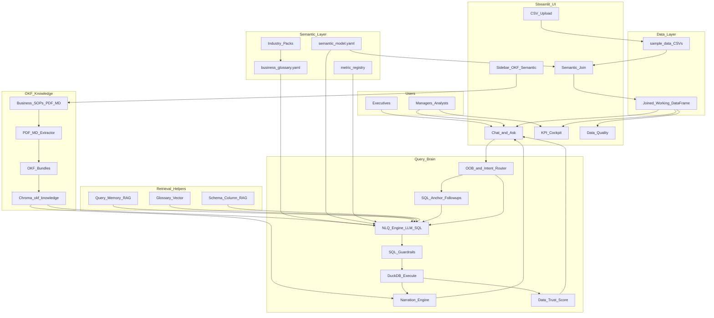
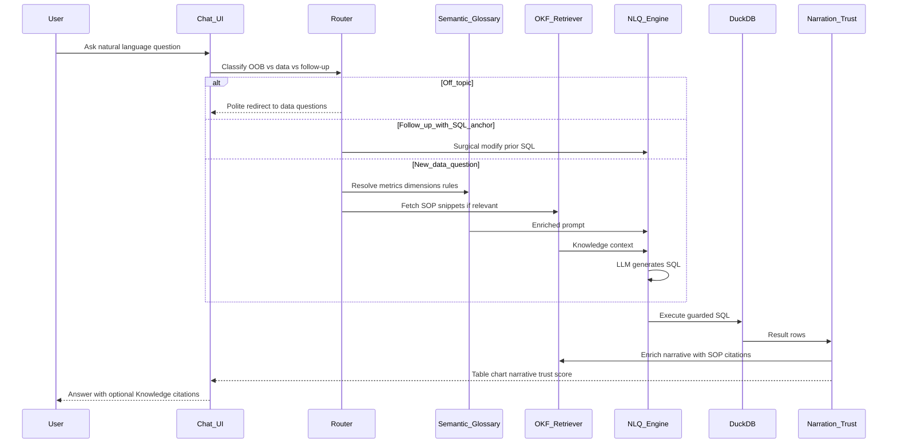

# AI Data Platform — Leader & Manager Demo Guide

**Audience:** Business leaders, sales heads, analytics managers  
**Purpose:** Explain how the app works (including OKF), and provide ready-to-ask sample questions for demos.  
**Domain pack:** India Passenger Vehicle sales (`sample_data/`, 2019–mid 2026)

---

## 1. What this platform does (in one minute)

Users ask questions in plain English. The platform:

1. Understands the question using a **semantic layer** (business glossary + data model).
2. Generates **safe SQL** against the joined sales dataset.
3. Returns a **table/chart + narrative**.
4. Optionally grounds the story in **business SOPs** (OKF knowledge) — e.g. how to interpret COVID years or EV share.
5. Remembers the last successful query so **follow-ups** refine the same analysis instead of starting over.

This is closer to a **Fabric-style Copilot over a semantic model**, with an added **policy / SOP knowledge** layer.

---

## 2. High-level architecture (for leaders)

### How a single question flows

---

## 3. Modules at a glance

| Layer | Module | What leaders should know |
|---|---|---|
| UI | Chat / Ask, KPI, DQ, Join, Sidebar | Where users interact |
| Data | CSV upload + semantic join | Fact + dimensions become one analytical table |
| Semantic | `semantic_model.yaml`, glossary, industry packs | Certified definitions of Revenue, Units, Quarters, etc. |
| OKF | SOPs in `doc/business_knowledge/` | Business policy / interpretation — not a replacement for SQL |
| RAG helpers | Query memory, glossary vectors, schema trim | Make SQL generation more accurate and cheaper |
| Query brain | NLQ engine, SQL anchor, guardrails, DuckDB | Turns language into numbers safely |
| Insight | Narration + Trust Score | Explains results and shows confidence |

**Important distinction**

- **Semantic layer** answers: *What is the certified number?*  
- **OKF / SOPs** answer: *How should we interpret this for the business?*  
- Together they produce **decision-grade** answers, not just charts.

---

## 4. Before you demo — seed OKF

1. Upload all 5 CSVs from `sample_data/` (or use semantic join).  
2. Sidebar → **Knowledge Base (OKF)** → **SEED INDIA PV SOPs**.  
3. Confirm Docs / Concepts counts are non-zero.  
4. Ask a COVID or EV question and look for **📎 Knowledge** citations on the narration card.

SOP pack:

| ID | Topic |
|---|---|
| IND-PV-SOP-001 | Metric definitions (Revenue vs Units) |
| IND-PV-SOP-002 | COVID baseline & recovery |
| IND-PV-SOP-003 | EV / powertrain reporting |
| IND-PV-SOP-004 | Regional performance framework |
| IND-PV-GUIDE-005 | Executive narrative standards |

---

## 5. Sample questions — starter (simple)

Use these for a warm-up with managers:

1. Show revenue by make  
2. Units sold by colour  
3. Top 10 salespeople by revenue  
4. Monthly revenue trend  
5. Revenue by car type  
6. Units sold by region  
7. Average selling price by make  
8. How many orders in 2024  
9. Top selling car  
10. Revenue by city  

**Note:** *Top selling car* uses **units** (`SUM(order_qty)`), not revenue.

---

## 6. Sample questions — complex / analytical

These show joins, time intelligence, mix, and leadership storytelling:

1. Compare units sold by make for 2019 versus 2020 and 2024  
2. Revenue and units by quarter for 2023 and 2024  
3. Which make gained the most units between 2021 and 2025  
4. EV share of units by year from 2019 to 2026  
5. Units sold by engine type and car type for 2025  
6. Top 10 models by units sold in West region only  
7. Revenue by region and make for Q4-2024 festive period months  
8. Which cities lead SUV units sold since 2023  
9. Average order value by make for Tata, Maruti and Mahindra  
10. Monthly units trend for Electric vehicles only  
11. Top 5 colours by units for Maruti hatchbacks  
12. Salesperson productivity — revenue per salesperson by South region  
13. Units sold by make where engine type is Hybrid or Electric  
14. Year-over-year units for Delhi NCR versus Mumbai  
15. Rank car types by revenue contribution in 2025 and show units alongside  

Suggested wording for quarters (labels are `Q1-2023` style):

- Show revenue by quarter for 2023  
- Units sold by quarter and make for 2024  

---

## 7. Sample questions — designed to show OKF (SOP grounding)

Ask these **after seeding SOPs**. Look for business context + citation (SOP id / source doc).

| # | Question | Why OKF helps |
|---|---|---|
| 1 | Why were 2020 sales down? | SOP-002 COVID lockdown narrative — not brand failure by default |
| 2 | Have we recovered from COVID in units? | SOP-002 recovery checklist vs 2019 baseline |
| 3 | Is EV demand increasing? | SOP-003 EV share on **units**, ICE still majority |
| 4 | How should we report EV share? | SOP-003 certified formula |
| 5 | What does top selling mean in our metrics? | SOP-001 units vs revenue disambiguation |
| 6 | Should we use 2020 as a YoY baseline? | SOP-002 — depressed baseline disclaimer |
| 7 | How do we drill regional performance? | SOP-004 Country → Zone → City path |
| 8 | What battery field means for EVs? | SOP-003 `engine_capacity` = kWh for Electric |
| 9 | Why might Q4 look unusually strong? | SOP-001 / SOP-002 festive seasonality |
| 10 | What makes an executive-ready insight? | GUIDE-005 L1–L4 quality bar |

**Hybrid demo (numbers + knowledge):**

1. Units sold by year  
2. Follow with: Why was 2020 so low compared to 2019?  
3. Then: Show EV share of units by year  
4. Follow with: According to our standards, is this EV growth meaningful?

---

## 8. Sample chat follow-up sequences

Each block is one continuous chat. Do **not** clear chat between lines.

### Sequence A — Top sellers → refine

| Turn | User says | Expected behaviour |
|---|---|---|
| 1 | Top selling car | Rank models by `SUM(order_qty)` |
| 2 | Add make | Same query + make column (✏️ Modified) |
| 3 | Only for 2024 | Keep ranking, filter year 2024 |
| 4 | Top 5 only | Limit 5, preserve filters |
| 5 | What about Tata | Filter / focus Tata |
| 6 | Show me revenue by salesperson | **New** topic — fresh SQL |

### Sequence B — Regional deep dive

| Turn | User says | Expected behaviour |
|---|---|---|
| 1 | Units sold by region | Zone roll-up |
| 2 | Same for South | Filter South |
| 3 | Add city | Drill to city within South |
| 4 | And for SUV only | Add car_type filter |
| 5 | Order by units descending | Sort change |

### Sequence C — COVID + OKF story (leadership favourite)

| Turn | User says | Expected behaviour |
|---|---|---|
| 1 | Units sold by year | Volume time series |
| 2 | Why were 2020 sales down? | Narrative + SOP-002 citation |
| 3 | Compare 2019 and 2024 units by make | Recovery vs pre-COVID |
| 4 | What about EV share by year? | New/related analysis + SOP-003 cues |

### Sequence D — Metric disambiguation

| Turn | User says | Expected behaviour |
|---|---|---|
| 1 | Top selling model | **Units** ranking |
| 2 | Now show highest revenue model | **Revenue** ranking (explicit) |
| 3 | Same for West | Apply West filter to revenue ranking |

### Sequence E — Festive / quarter

| Turn | User says | Expected behaviour |
|---|---|---|
| 1 | Revenue by quarter for 2023 | Labels like Q1-2023 … Q4-2023 |
| 2 | Same for 2024 | Reuse shape, change year |
| 3 | Add make | Break quarter revenue by make |
| 4 | Remove make | Back to quarter-only |

---

## 9. What “good” looks like in the UI

For a strong demo answer, leaders should see:

1. **Execution badge** — Semantic + AI, Cache, or ✏️ Modified  
2. **Narration** — headline + short story + recommendation  
3. **📎 Knowledge** — when SOPs were used  
4. **Data Trust Score** — collapsed summary; expand for component breakdown  
5. **Table / chart** — readable labels (names, not raw IDs)  
6. **SQL expander** — for transparency with technical managers  

Red flags to avoid calling out as “bugs” in demo:

- Asking dinner / weather → polite redirect (correct behaviour)  
- “Top selling” ranked by revenue → should be fixed to units; if not, seed glossary / restart app  

---

## 10. Talking points for leaders

1. **One language for the business** — glossary prevents “sales” meaning three different things.  
2. **SOPs travel with the answer** — interpretation is auditable (citations).  
3. **Follow-ups feel like a conversation** — SQL anchor keeps filters and metrics stable.  
4. **Trust is visible** — confidence is scored, not hidden.  
5. **Path to warehouse** — same semantic + OKF contract can later sit on SQL Server, Synapse, Snowflake, or Databricks; CSVs are the current demo source.

---

## 11. Quick reference — files behind the flow

| Concern | Location |
|---|---|
| Chat UI | `ui/tab_query.py` |
| Sidebar / OKF seed | `ui/sidebar.py` |
| NLQ + SQL anchor routing | `core/nlq_engine.py` |
| Follow-up intent | `core/question_normaliser.py` |
| Conversation / anchor memory | `core/conversation_state.py` |
| Semantic model / glossary | `semantic/` |
| OKF extract / retrieve | `features/okf_knowledge/` |
| Narration + SOP enrich | `features/narration_engine.py` |
| Business SOPs | `doc/business_knowledge/` |

---

*Document version: 1.0 — aligned to India PV demo pack and OKF wiring.*
